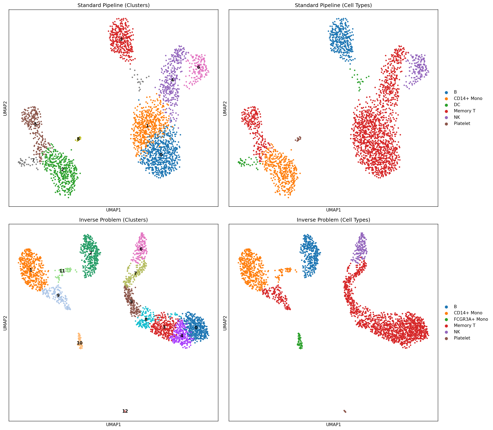

# Understanding the Inverse Problem in Single-Cell RNA Sequencing

## The Problem We're Solving

### What We Observe vs. What We Want to Know

In single-cell RNA sequencing (scRNA-seq), there's a fundamental gap between what we measure and what we actually want to know:

```
What we WANT:        Z_true (True biological expression in the cell)
                          ↓
                    [Measurement Process]
                          ↓
What we OBSERVE:     X_obs (Noisy, distorted counts)
```

### The Measurement Process Destroys Information

When we perform scRNA-seq, the true gene expression `Z_true` goes through several destructive steps:

1. **Capture Loss**: Only ~10-20% of mRNA molecules are captured during cell lysis
2. **Amplification Bias**: PCR amplification introduces gene-specific biases
3. **Sequencing Sampling**: Limited sequencing depth means we only sample a fraction of molecules

This creates the **forward model**:
```
X_observed = Sequencing(Amplification(Capture(Z_true))) + noise
```

### The Inverse Problem

We want to reverse this process:
```
Given: X_observed (what we measured)
Find:  Z_true (what the cell actually expressed)
```

This is mathematically ill-posed because:
- Information is lost at each step (especially dropout/zeros)
- Multiple different `Z_true` values could produce the same `X_observed`
- The measurement process is stochastic

### Our Solution: Bayesian Inference

Instead of finding a single "answer", we compute a **probability distribution** over possible true expression values:

```
p(Z_true | X_observed) ∝ p(X_observed | Z_true) × p(Z_true)
```

This gives us:
- **Best estimate**: The most likely true expression
- **Uncertainty**: How confident we are about each gene in each cell

---

## Understanding the Plots

### Plot 1: Comparison UMAP





| Standard Pipeline | Inverse Problem |
|-------------------|-----------------|
| 9 clusters | 15 clusters |
| Based on normalized counts | Based on inferred true expression |
| No uncertainty quantification | Provides uncertainty estimates |

**Left Panel - Standard Pipeline:**
- Traditional Scanpy workflow: normalize → log → HVG → PCA → cluster
- Treats observed counts as ground truth
- Ignores measurement noise and dropout

**Right Panel - Inverse Problem:**
- Infers the underlying true expression `Z_true`
- Finds **more clusters (15 vs 9)** - this could mean:
  - Discovering subtle cell states hidden by technical noise
  - OR over-splitting due to model assumptions
- Different cluster structure reflects working with denoised data

**Key Insight**: The inverse approach reveals more granular cell populations because it attempts to see through the technical noise to the true biological signal.

---

### Plot 2: Uncertainty Analysis


**Left Panel - Cluster Assignments:**
- The 15 clusters identified by the inverse problem approach
- Each color represents a distinct cell population

**Middle Panel - Cluster Confidence:**
- **Green = High confidence** (0.25-0.35): Cells clearly belonging to their assigned cluster
- **Red = Low confidence** (0.05-0.10): Cells with uncertain cluster membership
- Scale shows confidence ranges from ~0.05 to ~0.35

**Interpretation:**
- Most cells show moderate confidence (green regions)
- Cells at cluster boundaries have lower confidence (expected)
- This tells us WHERE our clustering is reliable vs uncertain

**Right Panel - Cluster Distance:**
- How far each cell is from other cluster centers
- **Dark purple = Close to multiple clusters** (ambiguous identity)
- **Yellow = Far from other clusters** (distinct identity)

**Key Insight**: Unlike standard pipelines that give binary cluster assignments, the inverse approach tells us "this cell is 70% likely cluster A, 20% likely cluster B" - crucial for:
- Identifying transitional cell states
- Finding cells undergoing differentiation
- Detecting doublets or ambient RNA contamination

---

## Why This Matters

### Standard Pipeline Limitations

```python
# Standard approach assumes:
X_normalized = X_observed / library_size  # Just scaling!
# This doesn't account for:
# - Gene-specific capture efficiency
# - Dropout (zeros that should be non-zero)
# - Amplification bias
```

### Inverse Problem Advantages

1. **Denoised Expression**: `Z_true` represents what the cell actually expressed
2. **Uncertainty Quantification**: Know which measurements to trust
3. **Principled Handling of Zeros**: Distinguishes biological zeros from technical dropout
4. **Interpretable Programs**: Learns transcriptional programs that explain cell states

### Practical Applications

| Use Case | Standard Pipeline | Inverse Problem |
|----------|-------------------|-----------------|
| Rare cell detection | May miss due to noise | Better sensitivity |
| Differential expression | Confounded by technical variation | Cleaner signal |
| Trajectory inference | Noisy trajectories | Smoother, more reliable |
| Batch correction | Heuristic corrections | Principled noise modeling |

---

## Mathematical Framework

### Forward Model (Measurement)
```
p(X | Z) = Poisson(M(Z))

where M(Z) = Sequencing ∘ Amplification ∘ Capture
```

### Prior (Biology)
```
p(Z) = Σ_k  π_k × Program_k

# Cells are mixtures of transcriptional programs
```

### Posterior (What We Compute)
```
p(Z | X) ∝ p(X | Z) × p(Z)

# Computed via variational inference (ELBO optimization)
```

### What the Model Learns

1. **Per-gene capture probabilities**: Which genes have high/low dropout
2. **Transcriptional programs**: Recurring expression patterns
3. **Cell state compositions**: How much each program is active in each cell
4. **Denoised expression**: Best estimate of true expression with uncertainty

---

## Summary

The inverse problem approach fundamentally changes how we analyze scRNA-seq:

| Aspect | Standard | Inverse Problem |
|--------|----------|-----------------|
| Philosophy | "Trust the data" | "Data is corrupted, infer truth" |
| Output | Point estimates | Distributions with uncertainty |
| Zeros | All zeros equal | Biological vs technical zeros |
| Clustering | Hard assignments | Soft assignments with confidence |
| Interpretation | "These genes are expressed" | "We're X% confident these genes are expressed" |

The plots you generated show that the inverse approach:
1. Reveals finer-grained cell populations (15 vs 9 clusters)
2. Provides uncertainty estimates for every cell
3. Identifies which cells have ambiguous identities

This is particularly valuable for:
- Clinical applications where confidence matters
- Discovering rare or transitional cell states
- Making reproducible, statistically rigorous conclusions
